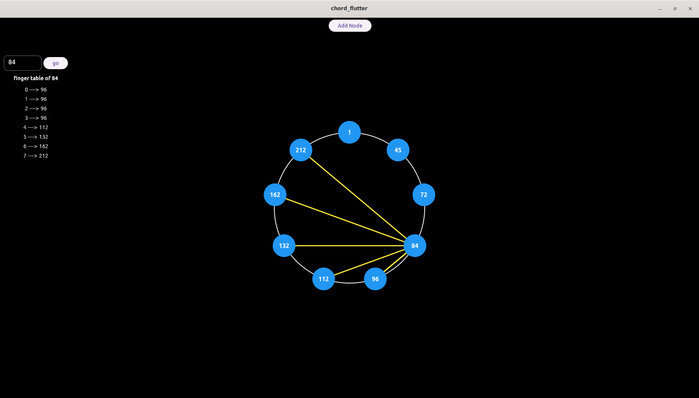

# Project Title: Chord Algorithm Visualization

This project is a demonstration of the Chord Distributed Hash Table (DHT) algorithm in a peer-to-peer network. It provides a visual representation of how nodes in the Chord network update their finger tables by checking the node IDs of known nodes.

The core logic of the Chord algorithm is implemented in the `chord.rs` file. This includes the creation of nodes, updating of finger tables, and handling of predecessors



### for running the linux app

Get the app folder and runapp.sh file. Now run the runapp.sh in the shell
```bash
./runapp.sh
```

## Getting Started

These instructions will get you a copy of the project up and running on your local machine for development and testing purposes.

### Prerequisites

- Rust programming language
- Flutter for UI visualization


### Installation

1. Clone the repository
```bash
git clone <repository-url>
```
2. Navigate into the rust project directory
```bash
cd <rust-project-directory>
```
3. Build the project
```bash
cargo build
```
4. Run the project
```bash
cargo run
```
5. Navigate into the Flutter directory
```bash
cd <flutter-project-directory>
```
6. Run the flutter application using
```bash
flutter run
```

## Usage

The application starts a rust local server that listens for incoming connection from Flutter app. It receives nodes from the Flutter, processes them, and sends back the fingertables.

The visualization of the finger table of each node can be viewed in the Flutter application.

## Built With

- [Rust](https://www.rust-lang.org/) - The programming language used
- [Flutter](https://flutter.dev/) - The UI toolkit used for building the visualization

## Contributing

If you want to improve the code, find any mistakes, or have any suggestions, feel free to make a pull request or create an issue. I appreciate your help in making this project better.

## License

This project is licensed under the MIT License - see the `LICENSE.md` file for details
